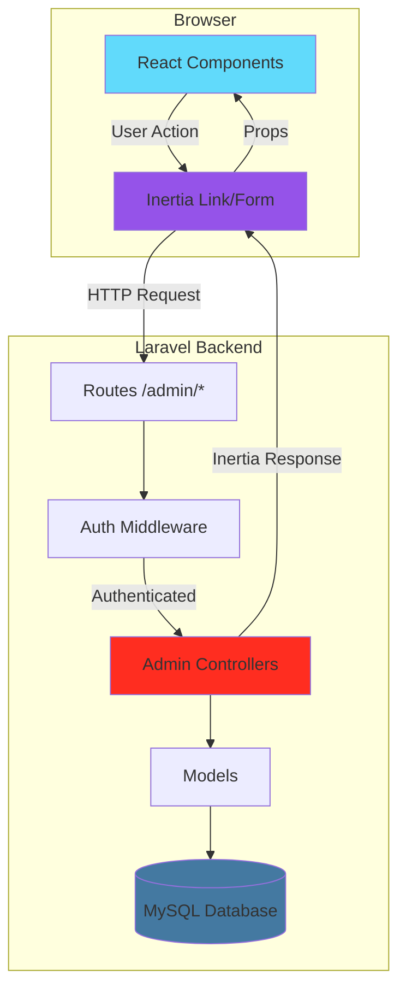
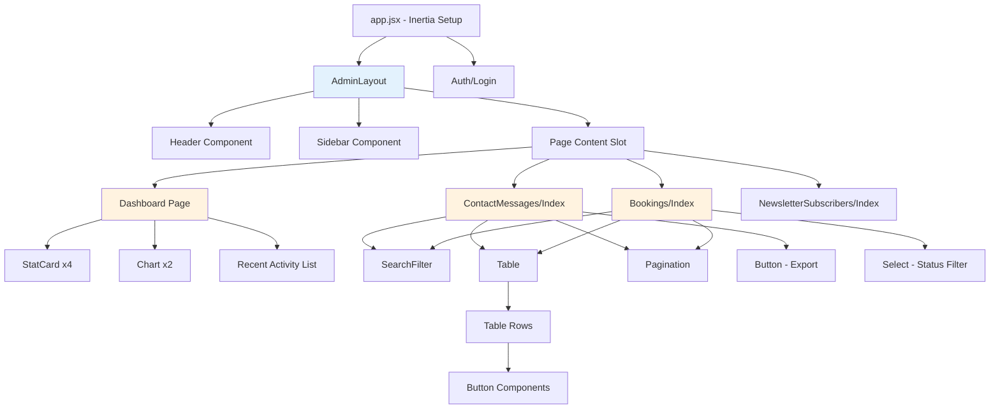
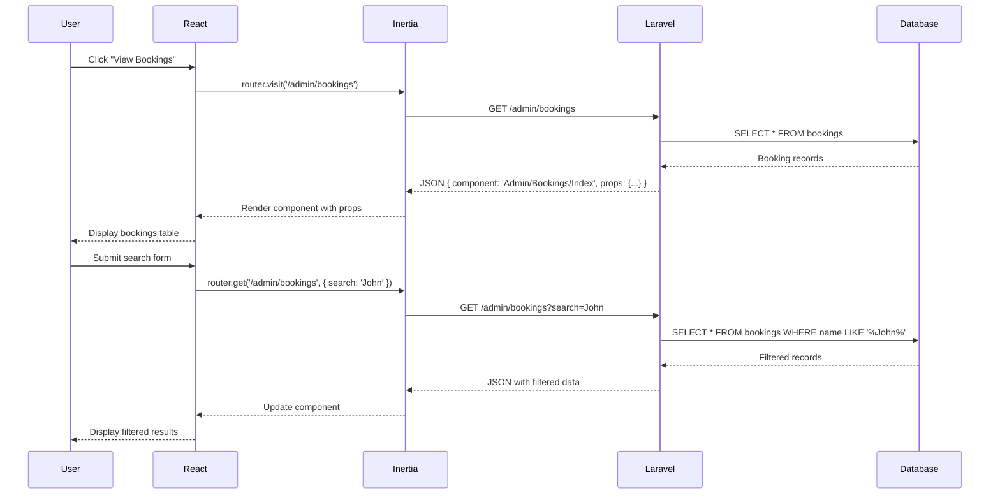
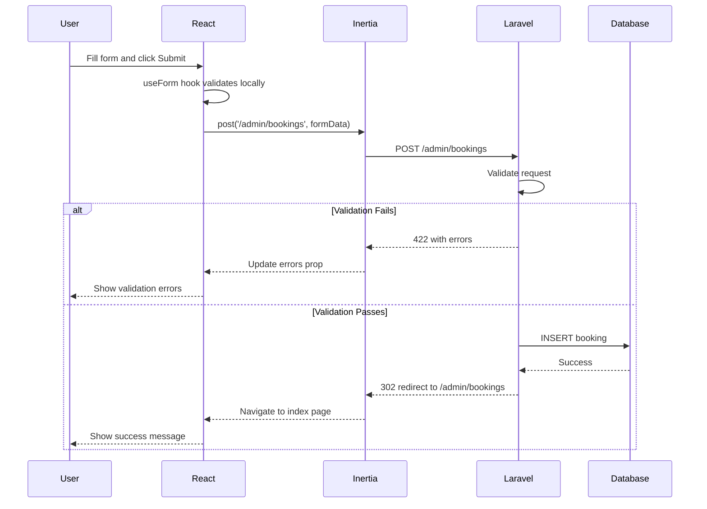
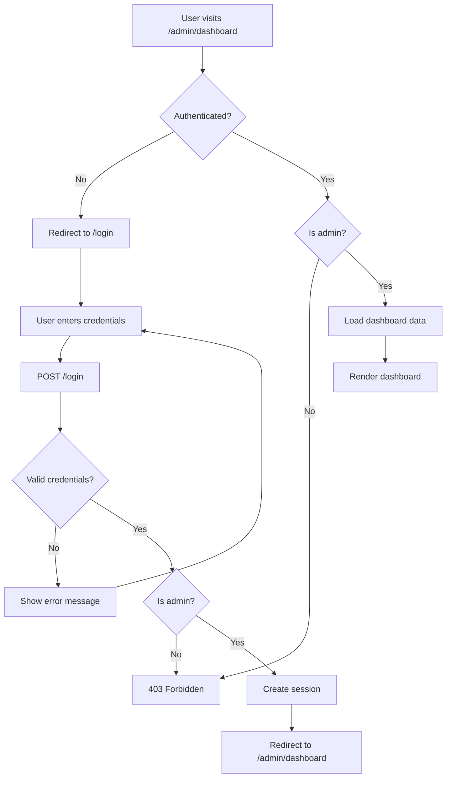

# Design Document: React Admin Dashboard

## Overview

This design document outlines the architecture and implementation strategy for a React-based admin dashboard integrated into a Laravel 11 tourism website using Inertia.js. The dashboard provides authenticated administrators with comprehensive tools to manage contact messages, bookings, newsletter subscribers, and website content while displaying analytics and statistics.

### Key Technologies

- **Backend**: Laravel 11 (PHP 8.2+)
- **Frontend**: React 18 with functional components and hooks
- **Bridge**: Inertia.js 1.0+ (eliminates need for separate API)
- **Styling**: Tailwind CSS 4.0
- **Build Tool**: Vite 7.0
- **Database**: MySQL (sipi-falls database in XAMPP)
- **Authentication**: Laravel's built-in authentication system

### Design Philosophy

This design prioritizes simplicity and beginner-friendliness:

1. **No Complex State Management**: Uses React's built-in useState and useEffect hooks only
2. **Inertia-First**: Leverages Inertia.js for routing, forms, and data passing (no REST API needed)
3. **Component Composition**: Small, reusable components following single responsibility principle
4. **Convention Over Configuration**: Clear folder structure with predictable naming patterns
5. **Progressive Enhancement**: Core functionality works first, then add polish

### Architecture Pattern

The application follows a **Server-Driven UI** pattern where:
- Laravel controllers handle business logic and data fetching
- Inertia.js passes data as props to React components
- React components focus purely on presentation and user interaction
- Form submissions go through Inertia (not fetch/axios)
- No client-side routing configuration needed

## Architecture

### High-Level Architecture Diagram



### Request Flow

1. **Initial Page Load**:
   - User navigates to `/admin/dashboard`
   - Laravel route matches and applies auth middleware
   - Controller fetches data from models
   - Controller returns `Inertia::render('Dashboard', $data)`
   - Inertia sends HTML with embedded JSON props
   - React hydrates and renders Dashboard component

2. **Subsequent Navigation**:
   - User clicks Inertia Link to `/admin/bookings`
   - Inertia intercepts click, makes XHR request
   - Laravel returns JSON response with component name and props
   - Inertia swaps React component without page reload
   - Browser URL updates via History API

3. **Form Submission**:
   - User submits form via Inertia useForm hook
   - Inertia sends POST/PUT/DELETE request
   - Laravel validates and processes
   - Returns redirect or validation errors
   - Inertia updates component with new data or shows errors

### Directory Structure

```
sipi-falls/
├── app/
│   ├── Http/
│   │   ├── Controllers/
│   │   │   └── Admin/              # New: Admin controllers
│   │   │       ├── DashboardController.php
│   │   │       ├── ContactMessageController.php
│   │   │       ├── BookingController.php
│   │   │       ├── NewsletterSubscriberController.php
│   │   │       └── ContentController.php
│   │   └── Middleware/
│   │       └── AdminMiddleware.php  # New: Admin auth check
│   └── Models/
│       ├── ContactMessage.php       # Existing
│       ├── Booking.php              # Existing
│       ├── NewsletterSubscriber.php # Existing
│       └── User.php                 # Existing (add is_admin field)
│
├── database/
│   └── migrations/
│       ├── 2026_03_04_add_status_fields.php        # New
│       └── 2026_03_04_add_admin_role_to_users.php  # New
│
├── resources/
│   ├── js/
│   │   ├── app.jsx                  # Modified: Inertia setup
│   │   ├── Pages/                   # New: Page components
│   │   │   ├── Admin/
│   │   │   │   ├── Dashboard.jsx
│   │   │   │   ├── ContactMessages/
│   │   │   │   │   ├── Index.jsx
│   │   │   │   │   └── Show.jsx
│   │   │   │   ├── Bookings/
│   │   │   │   │   ├── Index.jsx
│   │   │   │   │   ├── Show.jsx
│   │   │   │   │   ├── Create.jsx
│   │   │   │   │   └── Edit.jsx
│   │   │   │   ├── NewsletterSubscribers/
│   │   │   │   │   ├── Index.jsx
│   │   │   │   │   └── Create.jsx
│   │   │   │   └── Content/
│   │   │   │       ├── About.jsx
│   │   │   │       ├── Contact.jsx
│   │   │   │       └── TravelGuide.jsx
│   │   │   └── Auth/
│   │   │       └── Login.jsx
│   │   ├── Layouts/                 # New: Layout components
│   │   │   └── AdminLayout.jsx
│   │   └── Components/              # New: Reusable components
│   │       ├── Admin/
│   │       │   ├── Sidebar.jsx
│   │       │   ├── Header.jsx
│   │       │   ├── Table.jsx
│   │       │   ├── Pagination.jsx
│   │       │   ├── SearchFilter.jsx
│   │       │   ├── Modal.jsx
│   │       │   ├── Button.jsx
│   │       │   ├── Input.jsx
│   │       │   ├── Select.jsx
│   │       │   ├── Notification.jsx
│   │       │   ├── LoadingSpinner.jsx
│   │       │   ├── StatCard.jsx
│   │       │   └── Chart.jsx
│   │       └── ...
│   └── views/
│       └── app.blade.php            # New: Inertia root template
│
├── routes/
│   └── web.php                      # Modified: Add admin routes
│
├── package.json                     # Modified: Add React & Inertia
└── vite.config.js                   # Modified: Add React plugin
```

### Layer Responsibilities

#### 1. Laravel Backend Layer

**Routes** (`routes/web.php`):
- Define `/admin/*` route group with auth middleware
- Map URLs to controller methods
- Apply AdminMiddleware to verify admin role

**Controllers** (`app/Http/Controllers/Admin/*`):
- Fetch data from models
- Apply business logic (authorization, validation)
- Return Inertia responses with component name and props
- Handle CRUD operations
- Generate exports

**Models** (`app/Models/*`):
- Define database relationships
- Implement query scopes for filtering
- Handle data casting and accessors

**Middleware**:
- `auth`: Verify user is logged in
- `AdminMiddleware`: Verify user has admin privileges

#### 2. Inertia Bridge Layer

**Responsibilities**:
- Serialize Laravel data to JSON props
- Handle client-side routing without page reloads
- Manage form submissions and validation errors
- Preserve scroll position on navigation
- Show loading indicators during transitions

**Key Concepts**:
- **Shared Data**: Data available to all pages (auth user, flash messages)
- **Lazy Props**: Data loaded only when needed
- **Partial Reloads**: Refresh specific props without full page reload

#### 3. React Frontend Layer

**Pages** (`resources/js/Pages/Admin/*`):
- Receive props from Inertia
- Render full page content
- Use layout components for consistent structure
- Handle user interactions

**Layouts** (`resources/js/Layouts/*`):
- Provide consistent page structure (sidebar, header)
- Wrap page content
- Handle responsive behavior

**Components** (`resources/js/Components/Admin/*`):
- Small, reusable UI elements
- Accept props for configuration
- Emit events via callbacks
- No direct data fetching (receive data via props)

## Components and Interfaces

### Component Hierarchy



### Core Components

#### 1. AdminLayout Component

**Purpose**: Provides consistent layout structure for all admin pages

**Props**:
```javascript
{
  children: ReactNode,      // Page content
  title: string,            // Page title for breadcrumb
  auth: {                   // Shared from Laravel
    user: { name, email }
  }
}
```

**Structure**:
```jsx
<div className="flex h-screen bg-gray-100">
  <Sidebar />
  <div className="flex-1 flex flex-col overflow-hidden">
    <Header user={auth.user} title={title} />
    <main className="flex-1 overflow-y-auto p-6">
      {children}
    </main>
  </div>
</div>
```

**Responsive Behavior**:
- Desktop (≥768px): Fixed sidebar, header, scrollable content
- Mobile (<768px): Hidden sidebar, hamburger menu, full-width content

#### 2. Sidebar Component

**Purpose**: Navigation menu for admin sections

**Props**:
```javascript
{
  currentRoute: string  // Current page route name
}
```

**Navigation Items**:
```javascript
const navItems = [
  { name: 'Dashboard', href: '/admin/dashboard', icon: HomeIcon },
  { name: 'Contact Messages', href: '/admin/contact-messages', icon: MailIcon, badge: unreadCount },
  { name: 'Bookings', href: '/admin/bookings', icon: CalendarIcon },
  { name: 'Newsletter', href: '/admin/newsletter-subscribers', icon: UsersIcon },
  { name: 'Content', href: '/admin/content', icon: DocumentIcon },
]
```

**Features**:
- Highlights active route
- Shows unread count badge on Contact Messages
- Uses Inertia Link for navigation
- Collapsible on mobile

#### 3. Table Component

**Purpose**: Reusable data table with sorting and actions

**Props**:
```javascript
{
  columns: [
    { key: 'name', label: 'Name', sortable: true },
    { key: 'email', label: 'Email', sortable: false },
    // ...
  ],
  data: Array<Object>,
  onRowClick: (row) => void,
  actions: (row) => ReactNode,  // Render action buttons
  emptyMessage: string
}
```

**Features**:
- Responsive (horizontal scroll on mobile)
- Sortable columns
- Row click handler
- Action column for buttons
- Empty state message

**Example Usage**:
```jsx
<Table
  columns={[
    { key: 'first_name', label: 'First Name', sortable: true },
    { key: 'email', label: 'Email', sortable: true },
    { key: 'created_at', label: 'Date', sortable: true },
  ]}
  data={contactMessages}
  onRowClick={(msg) => router.visit(`/admin/contact-messages/${msg.id}`)}
  actions={(msg) => (
    <>
      <Button size="sm" onClick={() => toggleRead(msg.id)}>
        {msg.is_read ? 'Mark Unread' : 'Mark Read'}
      </Button>
      <Button size="sm" variant="danger" onClick={() => deleteMessage(msg.id)}>
        Delete
      </Button>
    </>
  )}
/>
```

#### 4. SearchFilter Component

**Purpose**: Real-time search input with debouncing

**Props**:
```javascript
{
  value: string,
  onChange: (value: string) => void,
  placeholder: string,
  debounceMs: number  // Default: 300
}
```

**Implementation**:
```jsx
const SearchFilter = ({ value, onChange, placeholder, debounceMs = 300 }) => {
  const [localValue, setLocalValue] = useState(value);
  
  useEffect(() => {
    const timer = setTimeout(() => {
      onChange(localValue);
    }, debounceMs);
    
    return () => clearTimeout(timer);
  }, [localValue]);
  
  return (
    <Input
      type="search"
      value={localValue}
      onChange={(e) => setLocalValue(e.target.value)}
      placeholder={placeholder}
      icon={<SearchIcon />}
    />
  );
};
```

#### 5. Pagination Component

**Purpose**: Navigate paginated data

**Props**:
```javascript
{
  links: [
    { url: string | null, label: string, active: boolean },
    // Generated by Laravel paginator
  ],
  from: number,      // First item number
  to: number,        // Last item number
  total: number      // Total items
}
```

**Features**:
- Previous/Next buttons
- Page number links
- Shows "Showing X-Y of Z"
- Uses Inertia Link to preserve filters

#### 6. Modal Component

**Purpose**: Confirmation dialogs and detail views

**Props**:
```javascript
{
  isOpen: boolean,
  onClose: () => void,
  title: string,
  children: ReactNode,
  footer: ReactNode  // Optional custom footer
}
```

**Features**:
- Backdrop click to close
- ESC key to close
- Focus trap
- Smooth animations

#### 7. Button Component

**Purpose**: Consistent button styling and states

**Props**:
```javascript
{
  children: ReactNode,
  onClick: () => void,
  variant: 'primary' | 'secondary' | 'danger' | 'success',
  size: 'sm' | 'md' | 'lg',
  loading: boolean,
  disabled: boolean,
  type: 'button' | 'submit'
}
```

**Variants**:
- `primary`: Blue background (main actions)
- `secondary`: Gray background (cancel, secondary actions)
- `danger`: Red background (delete, destructive actions)
- `success`: Green background (confirm, positive actions)

#### 8. Input Component

**Purpose**: Form input with validation error display

**Props**:
```javascript
{
  type: string,
  value: string,
  onChange: (e) => void,
  label: string,
  error: string,      // Validation error message
  required: boolean,
  placeholder: string,
  icon: ReactNode     // Optional leading icon
}
```

**Features**:
- Shows error message below input
- Red border when error present
- Required indicator (*)
- Accessible labels

#### 9. StatCard Component

**Purpose**: Display key metrics on dashboard

**Props**:
```javascript
{
  title: string,
  value: number | string,
  icon: ReactNode,
  trend: { value: number, direction: 'up' | 'down' },  // Optional
  color: 'blue' | 'green' | 'purple' | 'orange'
}
```

**Example**:
```jsx
<StatCard
  title="Total Bookings"
  value={bookingsCount}
  icon={<CalendarIcon />}
  trend={{ value: 12, direction: 'up' }}
  color="blue"
/>
```

#### 10. Chart Component

**Purpose**: Display time-series data

**Props**:
```javascript
{
  data: [
    { date: '2026-03-01', value: 5 },
    { date: '2026-03-02', value: 8 },
    // ...
  ],
  title: string,
  type: 'line' | 'bar'
}
```

**Implementation Note**: Use a lightweight library like `recharts` or `chart.js` for rendering.

### Page Components

#### Dashboard Page (`Pages/Admin/Dashboard.jsx`)

**Props from Laravel**:
```javascript
{
  stats: {
    totalContactMessages: number,
    totalBookings: number,
    totalNewsletterSubscribers: number,
    totalUsers: number,
    contactMessagesLast30Days: number,
    bookingsLast30Days: number,
  },
  chartData: {
    contactMessages: [{ date, count }],
    bookings: [{ date, count }],
  },
  recentActivity: {
    contactMessages: [{ id, name, email, created_at }],
    bookings: [{ id, fullname, email, created_at }],
  }
}
```

**Layout**:
```jsx
<AdminLayout title="Dashboard">
  <div className="grid grid-cols-1 md:grid-cols-2 lg:grid-cols-4 gap-6 mb-6">
    <StatCard {...} />
    <StatCard {...} />
    <StatCard {...} />
    <StatCard {...} />
  </div>
  
  <div className="grid grid-cols-1 lg:grid-cols-2 gap-6 mb-6">
    <Chart data={chartData.contactMessages} title="Contact Messages (7 days)" />
    <Chart data={chartData.bookings} title="Bookings (7 days)" />
  </div>
  
  <div className="grid grid-cols-1 lg:grid-cols-2 gap-6">
    <RecentActivityCard title="Recent Contact Messages" items={...} />
    <RecentActivityCard title="Recent Bookings" items={...} />
  </div>
</AdminLayout>
```

#### Contact Messages Index (`Pages/Admin/ContactMessages/Index.jsx`)

**Props from Laravel**:
```javascript
{
  contactMessages: {
    data: [
      {
        id: number,
        first_name: string,
        last_name: string,
        email: string,
        subject: string,
        message: string,
        is_read: boolean,
        created_at: string,
      }
    ],
    links: [...],  // Pagination links
    from: number,
    to: number,
    total: number,
  },
  filters: {
    search: string,
    status: 'all' | 'read' | 'unread',
  },
  unreadCount: number,
}
```

**Features**:
- Search by name, email, or subject
- Filter by read/unread status
- Mark as read/unread
- Delete messages
- Export to CSV
- View full message in modal

#### Bookings Index (`Pages/Admin/Bookings/Index.jsx`)

**Props from Laravel**:
```javascript
{
  bookings: {
    data: [
      {
        id: number,
        fullname: string,
        email: string,
        date_of_travel: string,
        num_adults: number,
        num_children: number,
        preferred_activities: string,
        budget: string,
        status: 'pending' | 'confirmed' | 'cancelled',
        created_at: string,
      }
    ],
    links: [...],
    from: number,
    to: number,
    total: number,
  },
  filters: {
    search: string,
    status: 'all' | 'pending' | 'confirmed' | 'cancelled',
  },
  statusCounts: {
    pending: number,
    confirmed: number,
    cancelled: number,
  }
}
```

**Features**:
- Search by name, email, or destination
- Filter by status
- Update status (pending/confirmed/cancelled)
- Create new booking
- Edit booking
- Delete booking
- Export to CSV

### Form Handling with Inertia

**Pattern**: Use Inertia's `useForm` hook for all forms

**Example - Create Booking Form**:
```jsx
import { useForm } from '@inertiajs/react';

const CreateBooking = () => {
  const { data, setData, post, processing, errors } = useForm({
    fullname: '',
    email: '',
    date_of_travel: '',
    num_adults: 1,
    num_children: 0,
    preferred_activities: '',
    budget: '',
  });
  
  const handleSubmit = (e) => {
    e.preventDefault();
    post('/admin/bookings', {
      onSuccess: () => {
        // Inertia will redirect to index page
      },
    });
  };
  
  return (
    <AdminLayout title="Create Booking">
      <form onSubmit={handleSubmit}>
        <Input
          label="Full Name"
          value={data.fullname}
          onChange={(e) => setData('fullname', e.target.value)}
          error={errors.fullname}
          required
        />
        
        <Input
          type="email"
          label="Email"
          value={data.email}
          onChange={(e) => setData('email', e.target.value)}
          error={errors.email}
          required
        />
        
        {/* More fields... */}
        
        <Button type="submit" loading={processing}>
          Create Booking
        </Button>
      </form>
    </AdminLayout>
  );
};
```

**Key Points**:
- `useForm` manages form state and submission
- `processing` indicates submission in progress
- `errors` contains validation errors from Laravel
- `post()` sends data to Laravel controller
- Inertia handles redirect after success

### State Management Strategy

**No Redux/Zustand Needed** - Use these patterns instead:

1. **Server State**: Managed by Laravel, passed as props
   ```jsx
   // Props from controller
   const { bookings, filters } = props;
   ```

2. **UI State**: Use useState for component-local state
   ```jsx
   const [isModalOpen, setIsModalOpen] = useState(false);
   const [selectedRow, setSelectedRow] = useState(null);
   ```

3. **Form State**: Use Inertia's useForm hook
   ```jsx
   const { data, setData, post, errors } = useForm({ ... });
   ```

4. **URL State**: Use Inertia's router for filters/search
   ```jsx
   import { router } from '@inertiajs/react';
   
   const handleSearch = (search) => {
     router.get('/admin/bookings', { search }, {
       preserveState: true,  // Keep component mounted
       preserveScroll: true, // Keep scroll position
     });
   };
   ```

5. **Shared State**: Pass via props or use Inertia's shared data
   ```php
   // In Laravel middleware
   Inertia::share([
     'auth' => fn () => [
       'user' => Auth::user(),
     ],
     'flash' => fn () => [
       'success' => session('success'),
       'error' => session('error'),
     ],
   ]);
   ```

## Data Models

### Database Schema Updates

#### 1. Add Status Fields Migration

**File**: `database/migrations/2026_03_04_add_status_fields.php`

```php
public function up(): void
{
    Schema::table('contact_messages', function (Blueprint $table) {
        $table->boolean('is_read')->default(false)->after('message');
    });
    
    Schema::table('bookings', function (Blueprint $table) {
        $table->enum('status', ['pending', 'confirmed', 'cancelled'])
              ->default('pending')
              ->after('budget');
    });
    
    Schema::table('newsletter_subscribers', function (Blueprint $table) {
        $table->enum('status', ['active', 'unsubscribed'])
              ->default('active')
              ->after('email');
    });
}
```

#### 2. Add Admin Role Migration

**File**: `database/migrations/2026_03_04_add_admin_role_to_users.php`

```php
public function up(): void
{
    Schema::table('users', function (Blueprint $table) {
        $table->boolean('is_admin')->default(false)->after('email');
    });
    
    // Create default admin user
    DB::table('users')->insert([
        'name' => 'Admin User',
        'email' => 'admin@sipifalls.com',
        'password' => Hash::make('password'),
        'is_admin' => true,
        'created_at' => now(),
        'updated_at' => now(),
    ]);
}
```

### Updated Model Definitions

#### ContactMessage Model

```php
class ContactMessage extends Model
{
    protected $fillable = [
        'first_name',
        'last_name',
        'email',
        'subject',
        'message',
        'is_read',
    ];
    
    protected $casts = [
        'is_read' => 'boolean',
        'created_at' => 'datetime',
    ];
    
    // Scopes for filtering
    public function scopeUnread($query)
    {
        return $query->where('is_read', false);
    }
    
    public function scopeRead($query)
    {
        return $query->where('is_read', true);
    }
    
    public function scopeSearch($query, $search)
    {
        return $query->where(function ($q) use ($search) {
            $q->where('first_name', 'like', "%{$search}%")
              ->orWhere('last_name', 'like', "%{$search}%")
              ->orWhere('email', 'like', "%{$search}%")
              ->orWhere('subject', 'like', "%{$search}%");
        });
    }
    
    // Accessor for full name
    public function getFullNameAttribute()
    {
        return "{$this->first_name} {$this->last_name}";
    }
}
```

#### Booking Model

```php
class Booking extends Model
{
    protected $fillable = [
        'fullname',
        'email',
        'date_of_travel',
        'num_adults',
        'num_children',
        'preferred_activities',
        'budget',
        'status',
    ];
    
    protected $casts = [
        'date_of_travel' => 'date',
        'num_adults' => 'integer',
        'num_children' => 'integer',
        'created_at' => 'datetime',
    ];
    
    // Scopes for filtering
    public function scopeStatus($query, $status)
    {
        if ($status && $status !== 'all') {
            return $query->where('status', $status);
        }
        return $query;
    }
    
    public function scopeSearch($query, $search)
    {
        return $query->where(function ($q) use ($search) {
            $q->where('fullname', 'like', "%{$search}%")
              ->orWhere('email', 'like', "%{$search}%");
        });
    }
    
    // Accessor for total guests
    public function getTotalGuestsAttribute()
    {
        return $this->num_adults + $this->num_children;
    }
}
```

#### NewsletterSubscriber Model

```php
class NewsletterSubscriber extends Model
{
    protected $fillable = [
        'email',
        'status',
    ];
    
    protected $casts = [
        'created_at' => 'datetime',
    ];
    
    // Scopes for filtering
    public function scopeActive($query)
    {
        return $query->where('status', 'active');
    }
    
    public function scopeSearch($query, $search)
    {
        return $query->where('email', 'like', "%{$search}%");
    }
}
```

#### User Model

```php
class User extends Authenticatable
{
    use HasFactory, Notifiable;
    
    protected $fillable = [
        'name',
        'email',
        'password',
        'is_admin',
    ];
    
    protected $hidden = [
        'password',
        'remember_token',
    ];
    
    protected function casts(): array
    {
        return [
            'email_verified_at' => 'datetime',
            'password' => 'hashed',
            'is_admin' => 'boolean',
        ];
    }
    
    // Check if user is admin
    public function isAdmin(): bool
    {
        return $this->is_admin;
    }
}
```

### Data Transfer Objects (Props)

**Pattern**: Controllers return structured data that becomes React props

**Example - Bookings Index Controller**:
```php
public function index(Request $request)
{
    $bookings = Booking::query()
        ->when($request->search, fn($q, $search) => $q->search($search))
        ->when($request->status, fn($q, $status) => $q->status($status))
        ->latest()
        ->paginate(15)
        ->withQueryString();  // Preserve filters in pagination
    
    return Inertia::render('Admin/Bookings/Index', [
        'bookings' => $bookings,
        'filters' => [
            'search' => $request->search,
            'status' => $request->status ?? 'all',
        ],
        'statusCounts' => [
            'pending' => Booking::where('status', 'pending')->count(),
            'confirmed' => Booking::where('status', 'confirmed')->count(),
            'cancelled' => Booking::where('status', 'cancelled')->count(),
        ],
    ]);
}
```

## Correctness Properties

*A property is a characteristic or behavior that should hold true across all valid executions of a system—essentially, a formal statement about what the system should do. Properties serve as the bridge between human-readable specifications and machine-verifiable correctness guarantees.*


### Property Reflection

After analyzing all acceptance criteria, I've identified several areas where properties can be consolidated:

**Redundancy Group 1 - Data Display Properties**:
- Properties 2.2, 3.2, 4.2 all test that table rows contain required fields
- These can be consolidated into a single property about table rendering completeness

**Redundancy Group 2 - Count Accuracy Properties**:
- Properties 2.7, 3.7, 4.6, 5.2, 5.3, 5.4, 5.5, 6.7, 7.5 all test that displayed counts match database counts
- These can be consolidated into a single property about count accuracy

**Redundancy Group 3 - Delete Operations**:
- Properties 2.6, 4.5 test that delete operations remove records from database
- These can be consolidated into a single property about delete operations

**Redundancy Group 4 - Search Filtering**:
- Properties 6.1, 6.2, 6.3 test that search filters work correctly
- These can be consolidated into a single property about search filtering

**Redundancy Group 5 - Status Filtering**:
- Properties 6.5, 6.6 test that status filters work correctly
- These can be consolidated into a single property about status filtering

**Redundancy Group 6 - Validation Messages**:
- Properties 13.1, 13.2, 13.3 test specific validation messages
- Property 11.5 tests general validation behavior
- These can be consolidated into properties about validation completeness

**Redundancy Group 7 - CRUD Notifications**:
- Properties 11.8, 11.9 test success/error notifications
- Properties 14.4, 14.5 test notification timing
- These can be consolidated into properties about notification behavior

**Redundancy Group 8 - Loading States**:
- Properties 14.2, 14.3, 14.7 test that buttons show loading states
- These can be consolidated into a single property about loading state display

After consolidation, we have the following unique, non-redundant properties:

### Property 1: Unauthenticated Access Redirect

*For any* admin route, when accessed by an unauthenticated user, the system should redirect to the login page.

**Validates: Requirements 1.2**

### Property 2: Admin Authorization

*For any* authenticated user without admin privileges, accessing any admin route should result in an authorization error.

**Validates: Requirements 1.3**

### Property 3: Table Data Completeness

*For any* data table (contact messages, bookings, newsletter subscribers), all required fields for each record should be present in the rendered output.

**Validates: Requirements 2.2, 3.2, 4.2**

### Property 4: Delete Operation Persistence

*For any* record (contact message, booking, newsletter subscription), when deleted through the admin interface, the record should no longer exist in the database.

**Validates: Requirements 2.6, 4.5**

### Property 5: Update Operation Persistence

*For any* booking record and any valid status change, when updated through the admin interface, the database should reflect the new status.

**Validates: Requirements 3.6**

### Property 6: Count Accuracy

*For any* displayed count (unread messages, bookings by status, active subscribers, analytics metrics), the count should match the actual number of records in the database meeting that criteria.

**Validates: Requirements 2.7, 3.7, 4.6, 5.2, 5.3, 5.4, 5.5, 6.7, 7.5**

### Property 7: Chart Data Accuracy

*For any* time-series chart (contact messages per day, bookings per day), the data points should match the actual count of records created on each date in the database.

**Validates: Requirements 5.6, 5.7**

### Property 8: Recent Activity Ordering

*For any* recent activity list, the displayed items should be the N most recent records ordered by creation date descending.

**Validates: Requirements 5.8**

### Property 9: Search Filter Correctness

*For any* search term applied to any data table, all returned results should contain the search term in at least one of the searchable fields (name, email, subject, etc.).

**Validates: Requirements 6.1, 6.2, 6.3**

### Property 10: Status Filter Correctness

*For any* status filter applied to any data table, all returned results should have the selected status value.

**Validates: Requirements 6.5, 6.6**

### Property 11: Pagination State Preservation

*For any* combination of search and filter parameters, navigating between pages should preserve those parameters in the URL and applied filters.

**Validates: Requirements 7.6**

### Property 12: Export Completeness

*For any* set of filtered records, the exported CSV file should contain all records that match the current filters.

**Validates: Requirements 8.4**

### Property 13: Export Header Presence

*For any* CSV export, the file should contain column headers as the first row.

**Validates: Requirements 8.5**

### Property 14: Export Date Formatting

*For any* date field in a CSV export, the value should match the format YYYY-MM-DD HH:MM:SS.

**Validates: Requirements 8.6**

### Property 15: Inertia Props Passing

*For any* Inertia response from a Laravel controller, the React component should receive all data passed to Inertia::render() as props.

**Validates: Requirements 10.2**

### Property 16: SPA Navigation

*For any* navigation between admin pages using Inertia Link, the page transition should occur via XHR without a full page reload.

**Validates: Requirements 10.4**

### Property 17: Validation Error Display

*For any* form validation error returned from the server, the error message should appear inline next to the corresponding form field.

**Validates: Requirements 10.7, 11.6**

### Property 18: Required Field Validation

*For any* form with required fields, submitting the form with any required field empty should fail validation and display "This field is required" for each missing field.

**Validates: Requirements 11.5, 13.1**

### Property 19: Email Validation

*For any* email input field, submitting an invalid email format should fail validation with the message "Please enter a valid email address".

**Validates: Requirements 13.2, 13.4**

### Property 20: Date Validation

*For any* date input field where past dates are not allowed, submitting a past date should fail validation with an appropriate error message.

**Validates: Requirements 13.3, 13.5**

### Property 21: CRUD Success Notification

*For any* successful CRUD operation (create, update, delete), a success notification should appear and automatically dismiss after 3 seconds.

**Validates: Requirements 11.8, 14.4**

### Property 22: CRUD Error Notification

*For any* failed CRUD operation, an error notification should appear and remain visible until manually dismissed by the user.

**Validates: Requirements 11.9, 14.5**

### Property 23: Form Submission Loading State

*For any* form submission in progress, the submit button should be disabled and display loading text ("Saving...", "Deleting...", "Generating export...", etc.).

**Validates: Requirements 14.2, 14.3, 14.7**

### Property 24: Sidebar Presence

*For any* admin page, the sidebar navigation menu should be present in the rendered output.

**Validates: Requirements 12.1**

### Property 25: Active Navigation Highlighting

*For any* admin page, the navigation menu item corresponding to the current page should have an active/highlighted state.

**Validates: Requirements 12.2**

### Property 26: Breadcrumb Accuracy

*For any* admin page, the breadcrumb trail should accurately reflect the current page location in the navigation hierarchy.

**Validates: Requirements 12.6**

### Property 27: Content Update Persistence

*For any* content management form (About, Contact, Travel Guide), when submitted, the changes should be saved to the database and reflected on the public website.

**Validates: Requirements 15.5**


## Error Handling

### Error Categories

#### 1. Authentication Errors

**Scenario**: User session expires or user is not authenticated

**Handling**:
```javascript
// Laravel Middleware
if (!Auth::check()) {
    return redirect()->route('login');
}
```

**User Experience**:
- Automatic redirect to login page
- Flash message: "Your session has expired. Please log in again."
- After login, redirect back to intended page

#### 2. Authorization Errors

**Scenario**: Authenticated user without admin privileges attempts to access admin routes

**Handling**:
```php
// AdminMiddleware
public function handle($request, Closure $next)
{
    if (!Auth::user()->isAdmin()) {
        abort(403, 'Unauthorized access');
    }
    return $next($request);
}
```

**User Experience**:
- Display 403 error page
- Message: "You do not have permission to access this page."
- Link to return to home page

#### 3. Validation Errors

**Scenario**: Form submission with invalid data

**Handling**:
```php
// Controller
$validated = $request->validate([
    'email' => 'required|email',
    'fullname' => 'required|string|max:255',
    'date_of_travel' => 'required|date|after:today',
]);
```

**User Experience**:
- Form remains on page (no redirect)
- Error messages appear below each invalid field
- Invalid fields highlighted with red border
- Form data preserved (user doesn't lose input)

**React Component**:
```jsx
const { data, setData, post, errors } = useForm({ ... });

<Input
  label="Email"
  value={data.email}
  onChange={(e) => setData('email', e.target.value)}
  error={errors.email}  // "The email field is required."
/>
```

#### 4. Database Errors

**Scenario**: Database connection failure or query error

**Handling**:
```php
try {
    $bookings = Booking::paginate(15);
} catch (\Exception $e) {
    Log::error('Database error: ' . $e->getMessage());
    return Inertia::render('Error', [
        'message' => 'Unable to load data. Please try again later.',
    ]);
}
```

**User Experience**:
- Display error page with user-friendly message
- Log detailed error for debugging
- Provide "Try Again" button
- Option to contact support

#### 5. Not Found Errors (404)

**Scenario**: User attempts to access non-existent record

**Handling**:
```php
$booking = Booking::findOrFail($id);  // Throws 404 if not found
```

**User Experience**:
- Display 404 error page
- Message: "The requested booking could not be found."
- Link to return to bookings list

#### 6. Server Errors (500)

**Scenario**: Unexpected server error

**Handling**:
```php
// Laravel automatically catches exceptions
// Custom error page in resources/views/errors/500.blade.php
```

**User Experience**:
- Display 500 error page
- Message: "Something went wrong. Our team has been notified."
- Error logged with full stack trace
- Link to return to dashboard

#### 7. Network Errors

**Scenario**: Request fails due to network issues

**Handling**:
```jsx
// Inertia automatically handles network errors
// Display error notification
import { router } from '@inertiajs/react';

router.on('error', (event) => {
  console.error('Network error:', event.detail);
  showNotification({
    type: 'error',
    message: 'Network error. Please check your connection.',
  });
});
```

**User Experience**:
- Error notification appears
- Request can be retried
- Form data preserved

### Error Logging Strategy

**Frontend Errors**:
```javascript
// Log to console in development
if (import.meta.env.DEV) {
  console.error('Error details:', error);
}

// Send to error tracking service in production
if (import.meta.env.PROD) {
  // Example: Sentry, Bugsnag, etc.
  errorTracker.captureException(error);
}
```

**Backend Errors**:
```php
// Laravel's built-in logging
Log::error('Failed to create booking', [
    'user_id' => Auth::id(),
    'data' => $request->all(),
    'error' => $e->getMessage(),
]);
```

### Graceful Degradation

**Principle**: Core functionality should work even if some features fail

**Examples**:

1. **Charts Fail to Load**:
   - Display error message in chart container
   - Rest of dashboard remains functional
   - Stats cards still display

2. **Export Fails**:
   - Show error notification
   - User can still view and manage data
   - Suggest alternative (copy data manually)

3. **Search Fails**:
   - Fall back to showing all records
   - Display warning message
   - Allow manual filtering

### User Feedback Patterns

**Loading States**:
```jsx
{processing && <LoadingSpinner />}
{!processing && data && <DataTable data={data} />}
{!processing && !data && <EmptyState />}
```

**Error States**:
```jsx
{error && (
  <div className="bg-red-50 border border-red-200 rounded p-4">
    <p className="text-red-800">{error.message}</p>
    <Button onClick={retry}>Try Again</Button>
  </div>
)}
```

**Success States**:
```jsx
{success && (
  <Notification type="success" duration={3000}>
    Booking created successfully!
  </Notification>
)}
```


## Testing Strategy

### Dual Testing Approach

This project uses both unit tests and property-based tests for comprehensive coverage:

- **Unit Tests**: Verify specific examples, edge cases, and integration points
- **Property Tests**: Verify universal properties across all inputs

Both are complementary and necessary. Unit tests catch concrete bugs, while property tests verify general correctness.

### Testing Stack

**Backend (Laravel)**:
- **Framework**: PHPUnit (included with Laravel)
- **Property Testing**: No native PHP PBT library - use extensive unit tests with data providers
- **Database**: SQLite in-memory for fast tests

**Frontend (React)**:
- **Framework**: Vitest (fast, Vite-native)
- **Property Testing**: fast-check (JavaScript PBT library)
- **Component Testing**: React Testing Library
- **E2E Testing**: Playwright (optional, for critical flows)

### Backend Testing

#### Laravel Controller Tests

**Location**: `tests/Feature/Admin/`

**Example - Contact Messages Controller Test**:
```php
<?php

namespace Tests\Feature\Admin;

use Tests\TestCase;
use App\Models\User;
use App\Models\ContactMessage;
use Illuminate\Foundation\Testing\RefreshDatabase;

class ContactMessageControllerTest extends TestCase
{
    use RefreshDatabase;
    
    protected function setUp(): void
    {
        parent::setUp();
        $this->admin = User::factory()->create(['is_admin' => true]);
    }
    
    /** @test */
    public function unauthenticated_users_cannot_access_contact_messages()
    {
        $response = $this->get('/admin/contact-messages');
        $response->assertRedirect('/login');
    }
    
    /** @test */
    public function non_admin_users_cannot_access_contact_messages()
    {
        $user = User::factory()->create(['is_admin' => false]);
        
        $response = $this->actingAs($user)->get('/admin/contact-messages');
        $response->assertStatus(403);
    }
    
    /** @test */
    public function admin_can_view_contact_messages_index()
    {
        ContactMessage::factory()->count(5)->create();
        
        $response = $this->actingAs($this->admin)
            ->get('/admin/contact-messages');
        
        $response->assertStatus(200);
        $response->assertInertia(fn ($page) => 
            $page->component('Admin/ContactMessages/Index')
                ->has('contactMessages.data', 5)
        );
    }
    
    /** @test */
    public function admin_can_search_contact_messages()
    {
        ContactMessage::factory()->create(['first_name' => 'John', 'email' => 'john@example.com']);
        ContactMessage::factory()->create(['first_name' => 'Jane', 'email' => 'jane@example.com']);
        
        $response = $this->actingAs($this->admin)
            ->get('/admin/contact-messages?search=John');
        
        $response->assertInertia(fn ($page) => 
            $page->has('contactMessages.data', 1)
                ->where('contactMessages.data.0.first_name', 'John')
        );
    }
    
    /** @test */
    public function admin_can_mark_message_as_read()
    {
        $message = ContactMessage::factory()->create(['is_read' => false]);
        
        $response = $this->actingAs($this->admin)
            ->patch("/admin/contact-messages/{$message->id}/toggle-read");
        
        $response->assertRedirect();
        $this->assertTrue($message->fresh()->is_read);
    }
    
    /** @test */
    public function admin_can_delete_contact_message()
    {
        $message = ContactMessage::factory()->create();
        
        $response = $this->actingAs($this->admin)
            ->delete("/admin/contact-messages/{$message->id}");
        
        $response->assertRedirect();
        $this->assertDatabaseMissing('contact_messages', ['id' => $message->id]);
    }
    
    /** @test */
    public function unread_count_is_accurate()
    {
        ContactMessage::factory()->count(3)->create(['is_read' => false]);
        ContactMessage::factory()->count(2)->create(['is_read' => true]);
        
        $response = $this->actingAs($this->admin)
            ->get('/admin/contact-messages');
        
        $response->assertInertia(fn ($page) => 
            $page->where('unreadCount', 3)
        );
    }
}
```

#### Model Tests

**Location**: `tests/Unit/Models/`

**Example - Booking Model Test**:
```php
<?php

namespace Tests\Unit\Models;

use Tests\TestCase;
use App\Models\Booking;
use Illuminate\Foundation\Testing\RefreshDatabase;

class BookingTest extends TestCase
{
    use RefreshDatabase;
    
    /** @test */
    public function it_calculates_total_guests_correctly()
    {
        $booking = Booking::factory()->create([
            'num_adults' => 2,
            'num_children' => 3,
        ]);
        
        $this->assertEquals(5, $booking->total_guests);
    }
    
    /** @test */
    public function status_scope_filters_by_status()
    {
        Booking::factory()->create(['status' => 'pending']);
        Booking::factory()->create(['status' => 'confirmed']);
        Booking::factory()->create(['status' => 'cancelled']);
        
        $pending = Booking::status('pending')->get();
        $this->assertCount(1, $pending);
        $this->assertEquals('pending', $pending->first()->status);
    }
    
    /** @test */
    public function search_scope_finds_bookings_by_name_or_email()
    {
        Booking::factory()->create(['fullname' => 'John Doe', 'email' => 'john@example.com']);
        Booking::factory()->create(['fullname' => 'Jane Smith', 'email' => 'jane@example.com']);
        
        $results = Booking::search('John')->get();
        $this->assertCount(1, $results);
        
        $results = Booking::search('example.com')->get();
        $this->assertCount(2, $results);
    }
}
```

### Frontend Testing

#### Component Unit Tests

**Location**: `resources/js/Components/__tests__/`

**Example - Button Component Test**:
```javascript
import { describe, it, expect, vi } from 'vitest';
import { render, screen, fireEvent } from '@testing-library/react';
import Button from '../Button';

describe('Button Component', () => {
  it('renders children correctly', () => {
    render(<Button>Click Me</Button>);
    expect(screen.getByText('Click Me')).toBeInTheDocument();
  });
  
  it('calls onClick handler when clicked', () => {
    const handleClick = vi.fn();
    render(<Button onClick={handleClick}>Click Me</Button>);
    
    fireEvent.click(screen.getByText('Click Me'));
    expect(handleClick).toHaveBeenCalledTimes(1);
  });
  
  it('is disabled when loading prop is true', () => {
    render(<Button loading>Click Me</Button>);
    expect(screen.getByRole('button')).toBeDisabled();
  });
  
  it('displays loading text when loading', () => {
    render(<Button loading>Click Me</Button>);
    expect(screen.getByText('Loading...')).toBeInTheDocument();
  });
  
  it('applies correct variant classes', () => {
    const { rerender } = render(<Button variant="primary">Button</Button>);
    expect(screen.getByRole('button')).toHaveClass('bg-blue-600');
    
    rerender(<Button variant="danger">Button</Button>);
    expect(screen.getByRole('button')).toHaveClass('bg-red-600');
  });
});
```

#### Property-Based Tests

**Location**: `resources/js/__tests__/properties/`

**Setup fast-check**:
```bash
npm install --save-dev fast-check
```

**Example - Search Filter Property Test**:
```javascript
import { describe, it } from 'vitest';
import fc from 'fast-check';

/**
 * Feature: react-admin-dashboard, Property 9: Search Filter Correctness
 * 
 * For any search term applied to any data table, all returned results 
 * should contain the search term in at least one of the searchable fields.
 */
describe('Property 9: Search Filter Correctness', () => {
  it('filters contact messages correctly for any search term', () => {
    fc.assert(
      fc.property(
        // Generate array of contact messages
        fc.array(fc.record({
          id: fc.integer({ min: 1 }),
          first_name: fc.string({ minLength: 1, maxLength: 50 }),
          last_name: fc.string({ minLength: 1, maxLength: 50 }),
          email: fc.emailAddress(),
          subject: fc.string({ minLength: 1, maxLength: 100 }),
        }), { minLength: 0, maxLength: 100 }),
        // Generate search term
        fc.string({ minLength: 1, maxLength: 20 }),
        (messages, searchTerm) => {
          // Apply search filter (same logic as backend)
          const filtered = messages.filter(msg => 
            msg.first_name.toLowerCase().includes(searchTerm.toLowerCase()) ||
            msg.last_name.toLowerCase().includes(searchTerm.toLowerCase()) ||
            msg.email.toLowerCase().includes(searchTerm.toLowerCase()) ||
            msg.subject.toLowerCase().includes(searchTerm.toLowerCase())
          );
          
          // Property: All filtered results must contain search term
          return filtered.every(msg => 
            msg.first_name.toLowerCase().includes(searchTerm.toLowerCase()) ||
            msg.last_name.toLowerCase().includes(searchTerm.toLowerCase()) ||
            msg.email.toLowerCase().includes(searchTerm.toLowerCase()) ||
            msg.subject.toLowerCase().includes(searchTerm.toLowerCase())
          );
        }
      ),
      { numRuns: 100 }  // Run 100 iterations
    );
  });
});
```

**Example - Count Accuracy Property Test**:
```javascript
/**
 * Feature: react-admin-dashboard, Property 6: Count Accuracy
 * 
 * For any displayed count, the count should match the actual number 
 * of records in the database meeting that criteria.
 */
describe('Property 6: Count Accuracy', () => {
  it('unread count matches actual unread messages', () => {
    fc.assert(
      fc.property(
        // Generate array of messages with random read status
        fc.array(fc.record({
          id: fc.integer({ min: 1 }),
          is_read: fc.boolean(),
        }), { minLength: 0, maxLength: 100 }),
        (messages) => {
          // Calculate expected unread count
          const expectedUnreadCount = messages.filter(m => !m.is_read).length;
          
          // Simulate what controller would return
          const unreadCount = messages.filter(m => !m.is_read).length;
          
          // Property: Displayed count must equal actual count
          return unreadCount === expectedUnreadCount;
        }
      ),
      { numRuns: 100 }
    );
  });
  
  it('status counts match actual bookings by status', () => {
    fc.assert(
      fc.property(
        // Generate array of bookings with random statuses
        fc.array(fc.record({
          id: fc.integer({ min: 1 }),
          status: fc.constantFrom('pending', 'confirmed', 'cancelled'),
        }), { minLength: 0, maxLength: 100 }),
        (bookings) => {
          // Calculate expected counts
          const expectedCounts = {
            pending: bookings.filter(b => b.status === 'pending').length,
            confirmed: bookings.filter(b => b.status === 'confirmed').length,
            cancelled: bookings.filter(b => b.status === 'cancelled').length,
          };
          
          // Simulate what controller would return
          const actualCounts = {
            pending: bookings.filter(b => b.status === 'pending').length,
            confirmed: bookings.filter(b => b.status === 'confirmed').length,
            cancelled: bookings.filter(b => b.status === 'cancelled').length,
          };
          
          // Property: All counts must match
          return expectedCounts.pending === actualCounts.pending &&
                 expectedCounts.confirmed === actualCounts.confirmed &&
                 expectedCounts.cancelled === actualCounts.cancelled;
        }
      ),
      { numRuns: 100 }
    );
  });
});
```

**Example - Validation Property Test**:
```javascript
/**
 * Feature: react-admin-dashboard, Property 19: Email Validation
 * 
 * For any email input field, submitting an invalid email format 
 * should fail validation.
 */
describe('Property 19: Email Validation', () => {
  it('rejects invalid email formats', () => {
    fc.assert(
      fc.property(
        // Generate invalid emails (strings without @ or .)
        fc.string().filter(s => !s.includes('@') || !s.includes('.')),
        (invalidEmail) => {
          // Simulate Laravel validation
          const emailRegex = /^[^\s@]+@[^\s@]+\.[^\s@]+$/;
          const isValid = emailRegex.test(invalidEmail);
          
          // Property: Invalid emails must fail validation
          return !isValid;
        }
      ),
      { numRuns: 100 }
    );
  });
  
  it('accepts valid email formats', () => {
    fc.assert(
      fc.property(
        // Generate valid emails
        fc.emailAddress(),
        (validEmail) => {
          // Simulate Laravel validation
          const emailRegex = /^[^\s@]+@[^\s@]+\.[^\s@]+$/;
          const isValid = emailRegex.test(validEmail);
          
          // Property: Valid emails must pass validation
          return isValid;
        }
      ),
      { numRuns: 100 }
    );
  });
});
```

### Integration Tests

**Location**: `tests/Feature/Admin/Integration/`

**Example - Full CRUD Flow Test**:
```php
/** @test */
public function admin_can_complete_full_booking_crud_flow()
{
    $this->actingAs($this->admin);
    
    // Create
    $response = $this->post('/admin/bookings', [
        'fullname' => 'John Doe',
        'email' => 'john@example.com',
        'date_of_travel' => now()->addDays(7)->format('Y-m-d'),
        'num_adults' => 2,
        'num_children' => 1,
        'preferred_activities' => 'Hiking, Swimming',
        'budget' => '1000-2000',
    ]);
    
    $response->assertRedirect('/admin/bookings');
    $booking = Booking::where('email', 'john@example.com')->first();
    $this->assertNotNull($booking);
    
    // Read
    $response = $this->get("/admin/bookings/{$booking->id}");
    $response->assertStatus(200);
    
    // Update
    $response = $this->put("/admin/bookings/{$booking->id}", [
        'status' => 'confirmed',
    ]);
    $response->assertRedirect();
    $this->assertEquals('confirmed', $booking->fresh()->status);
    
    // Delete
    $response = $this->delete("/admin/bookings/{$booking->id}");
    $response->assertRedirect();
    $this->assertDatabaseMissing('bookings', ['id' => $booking->id]);
}
```

### Test Configuration

**PHPUnit Configuration** (`phpunit.xml`):
```xml
<phpunit>
    <testsuites>
        <testsuite name="Feature">
            <directory>tests/Feature</directory>
        </testsuite>
        <testsuite name="Unit">
            <directory>tests/Unit</directory>
        </testsuite>
    </testsuites>
    <php>
        <env name="DB_CONNECTION" value="sqlite"/>
        <env name="DB_DATABASE" value=":memory:"/>
    </php>
</phpunit>
```

**Vitest Configuration** (`vitest.config.js`):
```javascript
import { defineConfig } from 'vitest/config';
import react from '@vitejs/plugin-react';

export default defineConfig({
  plugins: [react()],
  test: {
    environment: 'jsdom',
    setupFiles: ['./resources/js/test-setup.js'],
    globals: true,
  },
});
```

**Test Setup** (`resources/js/test-setup.js`):
```javascript
import '@testing-library/jest-dom';
import { expect, afterEach } from 'vitest';
import { cleanup } from '@testing-library/react';

// Cleanup after each test
afterEach(() => {
  cleanup();
});
```

### Running Tests

**Backend Tests**:
```bash
# Run all tests
php artisan test

# Run specific test file
php artisan test tests/Feature/Admin/ContactMessageControllerTest.php

# Run with coverage
php artisan test --coverage
```

**Frontend Tests**:
```bash
# Run all tests
npm run test

# Run in watch mode
npm run test:watch

# Run with coverage
npm run test:coverage

# Run property tests only
npm run test -- properties
```

### Test Coverage Goals

- **Backend**: Minimum 80% code coverage
- **Frontend Components**: Minimum 70% code coverage
- **Property Tests**: All 27 correctness properties implemented
- **Critical Paths**: 100% coverage (auth, CRUD operations, data export)


## Implementation Guide

### Phase 1: Setup and Configuration

#### Step 1.1: Install Inertia.js Server-Side

```bash
composer require inertiajs/inertia-laravel
```

**Publish Inertia middleware**:
```bash
php artisan inertia:middleware
```

**Register middleware** in `app/Http/Kernel.php`:
```php
'web' => [
    // ...
    \App\Http\Middleware\HandleInertiaRequests::class,
],
```

#### Step 1.2: Install React and Inertia Client-Side

```bash
npm install @inertiajs/react react react-dom
npm install --save-dev @vitejs/plugin-react
```

**Update `vite.config.js`**:
```javascript
import { defineConfig } from 'vite';
import laravel from 'laravel-vite-plugin';
import react from '@vitejs/plugin-react';
import tailwindcss from '@tailwindcss/vite';

export default defineConfig({
    plugins: [
        laravel({
            input: ['resources/css/app.css', 'resources/js/app.jsx'],
            refresh: true,
        }),
        react(),
        tailwindcss(),
    ],
});
```

#### Step 1.3: Create Inertia Root Template

**Create `resources/views/app.blade.php`**:
```blade
<!DOCTYPE html>
<html lang="{{ str_replace('_', '-', app()->getLocale()) }}">
<head>
    <meta charset="utf-8">
    <meta name="viewport" content="width=device-width, initial-scale=1">
    <title inertia>{{ config('app.name', 'Laravel') }}</title>
    @vite(['resources/css/app.css', 'resources/js/app.jsx'])
    @inertiaHead
</head>
<body>
    @inertia
</body>
</html>
```

#### Step 1.4: Initialize Inertia in React

**Rename `resources/js/app.js` to `app.jsx`** and update:
```jsx
import './bootstrap';
import { createRoot } from 'react-dom/client';
import { createInertiaApp } from '@inertiajs/react';
import { resolvePageComponent } from 'laravel-vite-plugin/inertia-helpers';

const appName = window.document.getElementsByTagName('title')[0]?.innerText || 'Laravel';

createInertiaApp({
    title: (title) => `${title} - ${appName}`,
    resolve: (name) => resolvePageComponent(`./Pages/${name}.jsx`, import.meta.glob('./Pages/**/*.jsx')),
    setup({ el, App, props }) {
        const root = createRoot(el);
        root.render(<App {...props} />);
    },
    progress: {
        color: '#4B5563',
    },
});
```

#### Step 1.5: Run Database Migrations

**Create new migrations**:
```bash
php artisan make:migration add_status_fields_to_tables
php artisan make:migration add_admin_role_to_users
```

**Run migrations**:
```bash
php artisan migrate
```

**Create admin user** (via tinker or seeder):
```bash
php artisan tinker
```
```php
User::create([
    'name' => 'Admin',
    'email' => 'admin@sipifalls.com',
    'password' => Hash::make('password'),
    'is_admin' => true,
]);
```

### Phase 2: Authentication Setup

#### Step 2.1: Create Admin Middleware

```bash
php artisan make:middleware AdminMiddleware
```

**Edit `app/Http/Middleware/AdminMiddleware.php`**:
```php
<?php

namespace App\Http\Middleware;

use Closure;
use Illuminate\Http\Request;
use Symfony\Component\HttpFoundation\Response;

class AdminMiddleware
{
    public function handle(Request $request, Closure $next): Response
    {
        if (!auth()->check()) {
            return redirect()->route('login');
        }
        
        if (!auth()->user()->isAdmin()) {
            abort(403, 'Unauthorized access to admin area');
        }
        
        return $next($request);
    }
}
```

**Register in `bootstrap/app.php`**:
```php
->withMiddleware(function (Middleware $middleware) {
    $middleware->alias([
        'admin' => \App\Http\Middleware\AdminMiddleware::class,
    ]);
})
```

#### Step 2.2: Create Login Page

**Create `resources/js/Pages/Auth/Login.jsx`**:
```jsx
import { useForm } from '@inertiajs/react';
import Input from '@/Components/Admin/Input';
import Button from '@/Components/Admin/Button';

export default function Login() {
    const { data, setData, post, processing, errors } = useForm({
        email: '',
        password: '',
        remember: false,
    });

    const handleSubmit = (e) => {
        e.preventDefault();
        post('/login');
    };

    return (
        <div className="min-h-screen flex items-center justify-center bg-gray-100">
            <div className="max-w-md w-full bg-white rounded-lg shadow-md p-8">
                <h1 className="text-2xl font-bold mb-6">Admin Login</h1>
                
                <form onSubmit={handleSubmit}>
                    <Input
                        type="email"
                        label="Email"
                        value={data.email}
                        onChange={(e) => setData('email', e.target.value)}
                        error={errors.email}
                        required
                    />
                    
                    <Input
                        type="password"
                        label="Password"
                        value={data.password}
                        onChange={(e) => setData('password', e.target.value)}
                        error={errors.password}
                        required
                    />
                    
                    <div className="mb-4">
                        <label className="flex items-center">
                            <input
                                type="checkbox"
                                checked={data.remember}
                                onChange={(e) => setData('remember', e.target.checked)}
                                className="mr-2"
                            />
                            <span className="text-sm">Remember me</span>
                        </label>
                    </div>
                    
                    <Button type="submit" loading={processing} className="w-full">
                        Log In
                    </Button>
                </form>
            </div>
        </div>
    );
}
```

#### Step 2.3: Setup Auth Routes

**Add to `routes/web.php`**:
```php
use App\Http\Controllers\Auth\LoginController;
use App\Http\Controllers\Admin\DashboardController;

// Auth routes
Route::get('/login', [LoginController::class, 'show'])->name('login');
Route::post('/login', [LoginController::class, 'login']);
Route::post('/logout', [LoginController::class, 'logout'])->name('logout');

// Admin routes
Route::prefix('admin')->middleware(['auth', 'admin'])->group(function () {
    Route::get('/dashboard', [DashboardController::class, 'index'])->name('admin.dashboard');
    // More routes will be added here
});
```

### Phase 3: Build Core Components

#### Step 3.1: Create AdminLayout

**Create `resources/js/Layouts/AdminLayout.jsx`**:
```jsx
import { useState } from 'react';
import { usePage } from '@inertiajs/react';
import Sidebar from '@/Components/Admin/Sidebar';
import Header from '@/Components/Admin/Header';

export default function AdminLayout({ children, title }) {
    const { auth } = usePage().props;
    const [sidebarOpen, setSidebarOpen] = useState(false);

    return (
        <div className="flex h-screen bg-gray-100">
            {/* Sidebar */}
            <Sidebar 
                isOpen={sidebarOpen} 
                onClose={() => setSidebarOpen(false)} 
            />
            
            {/* Main Content */}
            <div className="flex-1 flex flex-col overflow-hidden">
                <Header 
                    user={auth.user} 
                    title={title}
                    onMenuClick={() => setSidebarOpen(true)}
                />
                
                <main className="flex-1 overflow-y-auto p-6">
                    {children}
                </main>
            </div>
        </div>
    );
}
```

#### Step 3.2: Create Sidebar Component

**Create `resources/js/Components/Admin/Sidebar.jsx`**:
```jsx
import { Link, usePage } from '@inertiajs/react';
import { 
    HomeIcon, 
    MailIcon, 
    CalendarIcon, 
    UsersIcon, 
    DocumentIcon 
} from '@heroicons/react/24/outline';

export default function Sidebar({ isOpen, onClose }) {
    const { url } = usePage();
    
    const navigation = [
        { name: 'Dashboard', href: '/admin/dashboard', icon: HomeIcon },
        { name: 'Contact Messages', href: '/admin/contact-messages', icon: MailIcon },
        { name: 'Bookings', href: '/admin/bookings', icon: CalendarIcon },
        { name: 'Newsletter', href: '/admin/newsletter-subscribers', icon: UsersIcon },
        { name: 'Content', href: '/admin/content', icon: DocumentIcon },
    ];
    
    const isActive = (href) => url.startsWith(href);
    
    return (
        <>
            {/* Mobile backdrop */}
            {isOpen && (
                <div 
                    className="fixed inset-0 bg-black bg-opacity-50 z-20 md:hidden"
                    onClick={onClose}
                />
            )}
            
            {/* Sidebar */}
            <aside className={`
                fixed md:static inset-y-0 left-0 z-30
                w-64 bg-gray-800 text-white
                transform transition-transform duration-300 ease-in-out
                ${isOpen ? 'translate-x-0' : '-translate-x-full md:translate-x-0'}
            `}>
                <div className="flex items-center justify-between h-16 px-6 border-b border-gray-700">
                    <h1 className="text-xl font-bold">Sipi Falls Admin</h1>
                    <button 
                        onClick={onClose}
                        className="md:hidden text-gray-400 hover:text-white"
                    >
                        ✕
                    </button>
                </div>
                
                <nav className="mt-6">
                    {navigation.map((item) => {
                        const Icon = item.icon;
                        const active = isActive(item.href);
                        
                        return (
                            <Link
                                key={item.name}
                                href={item.href}
                                className={`
                                    flex items-center px-6 py-3 text-sm
                                    transition-colors duration-200
                                    ${active 
                                        ? 'bg-gray-900 text-white border-l-4 border-blue-500' 
                                        : 'text-gray-300 hover:bg-gray-700 hover:text-white'
                                    }
                                `}
                            >
                                <Icon className="w-5 h-5 mr-3" />
                                {item.name}
                            </Link>
                        );
                    })}
                </nav>
            </aside>
        </>
    );
}
```

#### Step 3.3: Create Reusable Components

**Button Component** (`resources/js/Components/Admin/Button.jsx`):
```jsx
export default function Button({ 
    children, 
    onClick, 
    type = 'button',
    variant = 'primary',
    size = 'md',
    loading = false,
    disabled = false,
    className = '',
}) {
    const baseClasses = 'font-medium rounded transition-colors duration-200 disabled:opacity-50 disabled:cursor-not-allowed';
    
    const variants = {
        primary: 'bg-blue-600 hover:bg-blue-700 text-white',
        secondary: 'bg-gray-600 hover:bg-gray-700 text-white',
        danger: 'bg-red-600 hover:bg-red-700 text-white',
        success: 'bg-green-600 hover:bg-green-700 text-white',
    };
    
    const sizes = {
        sm: 'px-3 py-1.5 text-sm',
        md: 'px-4 py-2 text-base',
        lg: 'px-6 py-3 text-lg',
    };
    
    return (
        <button
            type={type}
            onClick={onClick}
            disabled={disabled || loading}
            className={`${baseClasses} ${variants[variant]} ${sizes[size]} ${className}`}
        >
            {loading ? 'Loading...' : children}
        </button>
    );
}
```

**Input Component** (`resources/js/Components/Admin/Input.jsx`):
```jsx
export default function Input({
    type = 'text',
    label,
    value,
    onChange,
    error,
    required = false,
    placeholder = '',
    className = '',
}) {
    return (
        <div className={`mb-4 ${className}`}>
            {label && (
                <label className="block text-sm font-medium text-gray-700 mb-1">
                    {label}
                    {required && <span className="text-red-500 ml-1">*</span>}
                </label>
            )}
            
            <input
                type={type}
                value={value}
                onChange={onChange}
                placeholder={placeholder}
                required={required}
                className={`
                    w-full px-3 py-2 border rounded-md
                    focus:outline-none focus:ring-2 focus:ring-blue-500
                    ${error ? 'border-red-500' : 'border-gray-300'}
                `}
            />
            
            {error && (
                <p className="mt-1 text-sm text-red-600">{error}</p>
            )}
        </div>
    );
}
```

### Phase 4: Build Dashboard Page

#### Step 4.1: Create Dashboard Controller

```bash
php artisan make:controller Admin/DashboardController
```

**Edit `app/Http/Controllers/Admin/DashboardController.php`**:
```php
<?php

namespace App\Http\Controllers\Admin;

use App\Http\Controllers\Controller;
use App\Models\ContactMessage;
use App\Models\Booking;
use App\Models\NewsletterSubscriber;
use App\Models\User;
use Inertia\Inertia;
use Carbon\Carbon;

class DashboardController extends Controller
{
    public function index()
    {
        $thirtyDaysAgo = Carbon::now()->subDays(30);
        $sevenDaysAgo = Carbon::now()->subDays(7);
        
        return Inertia::render('Admin/Dashboard', [
            'stats' => [
                'totalContactMessages' => ContactMessage::count(),
                'totalBookings' => Booking::count(),
                'totalNewsletterSubscribers' => NewsletterSubscriber::where('status', 'active')->count(),
                'totalUsers' => User::count(),
                'contactMessagesLast30Days' => ContactMessage::where('created_at', '>=', $thirtyDaysAgo)->count(),
                'bookingsLast30Days' => Booking::where('created_at', '>=', $thirtyDaysAgo)->count(),
            ],
            'chartData' => [
                'contactMessages' => $this->getChartData(ContactMessage::class, $sevenDaysAgo),
                'bookings' => $this->getChartData(Booking::class, $sevenDaysAgo),
            ],
            'recentActivity' => [
                'contactMessages' => ContactMessage::latest()->take(5)->get(),
                'bookings' => Booking::latest()->take(5)->get(),
            ],
        ]);
    }
    
    private function getChartData($model, $startDate)
    {
        $data = [];
        $current = Carbon::parse($startDate);
        $end = Carbon::now();
        
        while ($current <= $end) {
            $count = $model::whereDate('created_at', $current)->count();
            $data[] = [
                'date' => $current->format('Y-m-d'),
                'count' => $count,
            ];
            $current->addDay();
        }
        
        return $data;
    }
}
```

#### Step 4.2: Create Dashboard Page Component

**Create `resources/js/Pages/Admin/Dashboard.jsx`**:
```jsx
import AdminLayout from '@/Layouts/AdminLayout';
import StatCard from '@/Components/Admin/StatCard';
import Chart from '@/Components/Admin/Chart';

export default function Dashboard({ stats, chartData, recentActivity }) {
    return (
        <AdminLayout title="Dashboard">
            {/* Stats Grid */}
            <div className="grid grid-cols-1 md:grid-cols-2 lg:grid-cols-4 gap-6 mb-6">
                <StatCard
                    title="Total Contact Messages"
                    value={stats.totalContactMessages}
                    color="blue"
                />
                <StatCard
                    title="Total Bookings"
                    value={stats.totalBookings}
                    color="green"
                />
                <StatCard
                    title="Newsletter Subscribers"
                    value={stats.totalNewsletterSubscribers}
                    color="purple"
                />
                <StatCard
                    title="Admin Users"
                    value={stats.totalUsers}
                    color="orange"
                />
            </div>
            
            {/* Charts */}
            <div className="grid grid-cols-1 lg:grid-cols-2 gap-6 mb-6">
                <Chart
                    data={chartData.contactMessages}
                    title="Contact Messages (Last 7 Days)"
                    type="line"
                />
                <Chart
                    data={chartData.bookings}
                    title="Bookings (Last 7 Days)"
                    type="bar"
                />
            </div>
            
            {/* Recent Activity */}
            <div className="grid grid-cols-1 lg:grid-cols-2 gap-6">
                <div className="bg-white rounded-lg shadow p-6">
                    <h3 className="text-lg font-semibold mb-4">Recent Contact Messages</h3>
                    <div className="space-y-3">
                        {recentActivity.contactMessages.map((msg) => (
                            <div key={msg.id} className="border-b pb-2">
                                <p className="font-medium">{msg.first_name} {msg.last_name}</p>
                                <p className="text-sm text-gray-600">{msg.email}</p>
                                <p className="text-xs text-gray-500">{msg.created_at}</p>
                            </div>
                        ))}
                    </div>
                </div>
                
                <div className="bg-white rounded-lg shadow p-6">
                    <h3 className="text-lg font-semibold mb-4">Recent Bookings</h3>
                    <div className="space-y-3">
                        {recentActivity.bookings.map((booking) => (
                            <div key={booking.id} className="border-b pb-2">
                                <p className="font-medium">{booking.fullname}</p>
                                <p className="text-sm text-gray-600">{booking.email}</p>
                                <p className="text-xs text-gray-500">{booking.created_at}</p>
                            </div>
                        ))}
                    </div>
                </div>
            </div>
        </AdminLayout>
    );
}
```

### Phase 5: Build CRUD Pages

Follow similar patterns for Contact Messages, Bookings, and Newsletter Subscribers:

1. Create controller with index, show, create, store, edit, update, destroy methods
2. Create page components in `resources/js/Pages/Admin/[Resource]/`
3. Use Table, SearchFilter, Pagination components
4. Implement Inertia forms with useForm hook
5. Add routes to `routes/web.php`

### Development Workflow

**Start development servers**:
```bash
# Terminal 1: Laravel server
php artisan serve

# Terminal 2: Vite dev server
npm run dev
```

**Access admin dashboard**:
```
http://localhost:8000/admin/dashboard
```

**Login credentials**:
- Email: admin@sipifalls.com
- Password: password


## Additional Diagrams

### Component Data Flow



### Form Submission Flow



### Authentication Flow



## Best Practices for React Beginners

### 1. Component Organization

**Keep components small and focused**:
```jsx
// ❌ Bad: One large component doing everything
function BookingsPage() {
  // 500 lines of code...
}

// ✅ Good: Break into smaller components
function BookingsPage() {
  return (
    <AdminLayout>
      <BookingsHeader />
      <BookingsFilters />
      <BookingsTable />
      <BookingsPagination />
    </AdminLayout>
  );
}
```

### 2. Props vs State

**Use props for data from parent, state for component-local data**:
```jsx
// Props: Data passed from parent (or Inertia)
function BookingsTable({ bookings, onDelete }) {
  // State: Component-local UI state
  const [selectedRow, setSelectedRow] = useState(null);
  const [isModalOpen, setIsModalOpen] = useState(false);
  
  return (
    // ...
  );
}
```

### 3. Avoid Prop Drilling

**Use composition instead of passing props through many levels**:
```jsx
// ❌ Bad: Prop drilling
<Layout user={user}>
  <Header user={user}>
    <UserMenu user={user} />
  </Header>
</Layout>

// ✅ Good: Use Inertia's usePage hook
function UserMenu() {
  const { auth } = usePage().props;
  return <div>{auth.user.name}</div>;
}
```

### 4. Handle Loading States

**Always show feedback during async operations**:
```jsx
function DeleteButton({ bookingId }) {
  const [isDeleting, setIsDeleting] = useState(false);
  
  const handleDelete = () => {
    setIsDeleting(true);
    router.delete(`/admin/bookings/${bookingId}`, {
      onFinish: () => setIsDeleting(false),
    });
  };
  
  return (
    <Button onClick={handleDelete} loading={isDeleting}>
      {isDeleting ? 'Deleting...' : 'Delete'}
    </Button>
  );
}
```

### 5. Use Inertia's useForm Hook

**Don't manage form state manually**:
```jsx
// ❌ Bad: Manual state management
const [fullname, setFullname] = useState('');
const [email, setEmail] = useState('');
const [errors, setErrors] = useState({});
// ... lots of boilerplate

// ✅ Good: Use useForm hook
const { data, setData, post, processing, errors } = useForm({
  fullname: '',
  email: '',
});
```

### 6. Destructure Props

**Make component signatures clear**:
```jsx
// ❌ Bad: Using props object
function StatCard(props) {
  return <div>{props.title}: {props.value}</div>;
}

// ✅ Good: Destructure props
function StatCard({ title, value, color }) {
  return <div>{title}: {value}</div>;
}
```

### 7. Use Meaningful Variable Names

```jsx
// ❌ Bad: Unclear names
const d = new Date();
const arr = bookings.filter(b => b.s === 'p');

// ✅ Good: Clear names
const currentDate = new Date();
const pendingBookings = bookings.filter(booking => booking.status === 'pending');
```

### 8. Extract Repeated Logic

```jsx
// ❌ Bad: Repeated code
<div className="bg-white rounded-lg shadow p-6">...</div>
<div className="bg-white rounded-lg shadow p-6">...</div>
<div className="bg-white rounded-lg shadow p-6">...</div>

// ✅ Good: Create a Card component
function Card({ children }) {
  return <div className="bg-white rounded-lg shadow p-6">{children}</div>;
}
```

### 9. Handle Errors Gracefully

```jsx
function BookingsTable({ bookings }) {
  if (!bookings || bookings.length === 0) {
    return (
      <div className="text-center py-12">
        <p className="text-gray-500">No bookings found.</p>
      </div>
    );
  }
  
  return (
    <table>
      {/* ... */}
    </table>
  );
}
```

### 10. Use Conditional Rendering Wisely

```jsx
// ❌ Bad: Nested ternaries
{isLoading ? <Spinner /> : data ? data.length > 0 ? <Table /> : <Empty /> : <Error />}

// ✅ Good: Early returns or clear conditions
if (isLoading) return <Spinner />;
if (!data) return <Error />;
if (data.length === 0) return <Empty />;
return <Table data={data} />;
```

## Common Pitfalls to Avoid

### 1. Forgetting to Preserve Filters in Pagination

```jsx
// ❌ Bad: Loses search/filter when paginating
<Link href={`/admin/bookings?page=2`}>Next</Link>

// ✅ Good: Preserve query parameters
<Link href={`/admin/bookings?page=2&search=${filters.search}&status=${filters.status}`}>
  Next
</Link>

// ✅ Better: Use Inertia's preserveState
router.get('/admin/bookings', { page: 2 }, { preserveState: true });
```

### 2. Not Handling Empty States

Always consider what happens when there's no data:
- Empty search results
- No records in database
- Failed API calls

### 3. Forgetting Mobile Responsiveness

Test every page at mobile viewport (< 768px):
- Sidebar should collapse
- Tables should scroll horizontally
- Forms should stack vertically

### 4. Not Validating on Both Client and Server

```jsx
// Client-side validation (UX)
const handleSubmit = (e) => {
  e.preventDefault();
  if (!data.email.includes('@')) {
    alert('Invalid email');
    return;
  }
  post('/admin/bookings');
};

// Server-side validation (Security)
$request->validate([
  'email' => 'required|email',
]);
```

### 5. Hardcoding URLs

```jsx
// ❌ Bad: Hardcoded URLs
<Link href="/admin/bookings/123">View</Link>

// ✅ Good: Use route helper or template literals
<Link href={`/admin/bookings/${booking.id}`}>View</Link>
```

## Performance Optimization

### 1. Lazy Load Heavy Components

```jsx
import { lazy, Suspense } from 'react';

const Chart = lazy(() => import('@/Components/Admin/Chart'));

function Dashboard() {
  return (
    <Suspense fallback={<LoadingSpinner />}>
      <Chart data={chartData} />
    </Suspense>
  );
}
```

### 2. Use Inertia's Partial Reloads

```jsx
// Only reload specific props
router.reload({ only: ['bookings'] });
```

### 3. Debounce Search Inputs

```jsx
useEffect(() => {
  const timer = setTimeout(() => {
    router.get('/admin/bookings', { search: searchTerm }, {
      preserveState: true,
    });
  }, 300);
  
  return () => clearTimeout(timer);
}, [searchTerm]);
```

### 4. Paginate Large Datasets

Always paginate tables with more than 15-20 records.

### 5. Optimize Images

Use appropriate image sizes and formats for logos and icons.

## Security Considerations

### 1. Always Validate on Server

Never trust client-side validation alone.

### 2. Use CSRF Protection

Laravel and Inertia handle this automatically, but ensure:
```blade
@csrf
```
is present in any non-Inertia forms.

### 3. Sanitize User Input

```php
// Laravel automatically escapes output
{{ $booking->fullname }}  // Safe

// Be careful with raw HTML
{!! $content !!}  // Only for trusted content
```

### 4. Implement Rate Limiting

```php
Route::middleware(['throttle:60,1'])->group(function () {
    // Admin routes
});
```

### 5. Log Security Events

```php
Log::warning('Unauthorized admin access attempt', [
    'user_id' => Auth::id(),
    'ip' => $request->ip(),
]);
```

## Deployment Checklist

- [ ] Run `npm run build` to compile production assets
- [ ] Set `APP_ENV=production` in `.env`
- [ ] Set `APP_DEBUG=false` in `.env`
- [ ] Configure proper database credentials
- [ ] Run `php artisan migrate --force`
- [ ] Run `php artisan config:cache`
- [ ] Run `php artisan route:cache`
- [ ] Run `php artisan view:cache`
- [ ] Set up proper file permissions (storage, bootstrap/cache)
- [ ] Configure web server (Apache/Nginx)
- [ ] Set up SSL certificate
- [ ] Configure backup strategy
- [ ] Set up error monitoring (Sentry, Bugsnag, etc.)
- [ ] Test all critical flows in production environment

## Conclusion

This design document provides a comprehensive blueprint for implementing a React-based admin dashboard using Inertia.js and Laravel. The architecture prioritizes simplicity, maintainability, and beginner-friendliness while ensuring robust functionality and proper testing coverage.

Key takeaways:
- Inertia.js eliminates the need for a separate API layer
- React components focus on presentation, Laravel handles business logic
- Property-based testing ensures correctness across all inputs
- Clear folder structure and naming conventions improve maintainability
- Comprehensive error handling provides good user experience

Follow the implementation guide phase by phase, and refer to the best practices section when in doubt. The correctness properties defined in this document should guide your testing strategy to ensure the dashboard works reliably across all scenarios.

